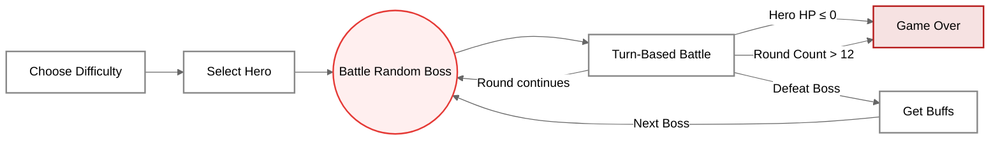
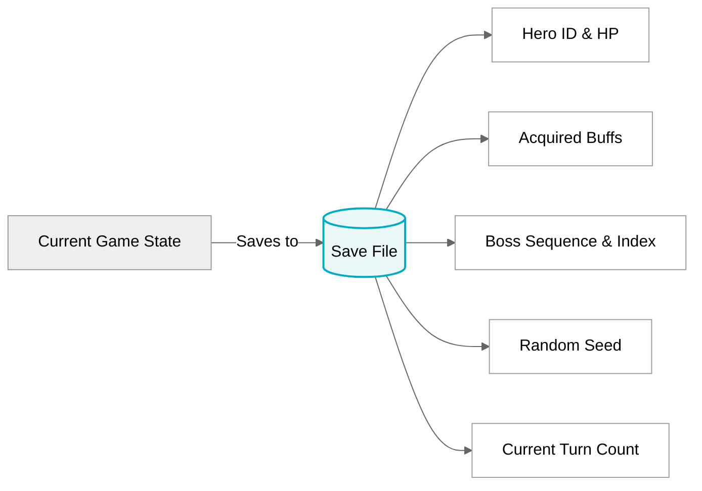

# Slay Text: Text-based Roguelike Card Game

> **COMP2113 Group Project** • The University of Hong Kong <br>
> A terminal turn-based deck-building card game inspired by *Slay the Spire*, built purely with standard C++17 STL.

## Game Description
**Slay Text** is a single-player, roguelike deck-building card game that runs entirely in the terminal. Players select one of three unique heroes, each with distinct passives and combat styles, and battle through a randomized sequence of bosses. Using energy as a core resource, players cast attack, defense, status, and utility cards to defeat enemies while managing buffs, debuffs, and a cycling deck system. 

After each boss victory, players earn permanent buffs to strengthen their subsequent encounters. The game includes three difficulty levels and a complete **Save/Load system** that preserves hero health, upgrades, and campaign progress. Victory requires defeating all bosses in sequence; defeat occurs if hero health drops to 0.

---

## How to Build and Run

### 1. Prerequisites
This project uses **only standard C++17 libraries (STL)**. No external installations or non-standard libraries are required for Linux/macOS/WSL.

### 2. Compilation
Run the following command in the project root directory (ensure you have `clang++` or `g++` installed as specified in the `Makefile`):

```bash
make all
```

### 3. Execution

After successful compilation, start the game by running:

```bash
./slay_text
```

### 4. Clean Build Files

```bash
make clean
```

------

## Gameplay Basics

### Core Game Loop

The game follows an escalating challenge loop. You can save or load your progress at any time.


### Game Rules

#### Round Flow

Each round against a boss strictly follows these 5 phases:

1. **Reset Energy** —— *Energy is fully refilled at the start*
2. **Draw Cards**
3. **Play Cards**
4. **Boss Acts**
5. **Status Effects Resolve**

#### Key Mechanics

- **Deck Cycle**: Auto-cycles from Draw Pile → Hand → Discard Pile.
- **Turn Limit**: Must defeat each boss within **12 rounds**, otherwise the run fails.
- **Defeat Condition**: Hero HP ≤ 0 triggers **Game Over**.
- **Reward System**: Faster victories = **more permanent buff choices**.

----

## Required Coding Elements & Features

Here is how our project implements the required coding elements to support the core game features:

### 1. Generation of Random Events

- **Supported Features:** Randomized card drawing, randomized boss selection and sequence, fluctuating boss HP limits, and buff reward drops.
- **Implementation:** We utilize the `<random>` library, specifically `std::mt19937` with a seed based on the current system time (`std::time(nullptr)`) in `main.cpp`, to ensure unpredictable and dynamic gameplay per run.

### 2. Data Structures for Storing Data

- **Supported Features:** Managing Hero attributes, Card properties, Boss state, dynamically cycling Decks, Hand cards, and active Buffs.
- **Implementation:** Extensively uses `std::vector` to hold collections of cards and templates. We implemented custom structs and classes (`Hero`, `Card`, `Boss`, `Deck`, `Battle`) to encapsulate game entity logic cleanly.

### 3. Dynamic Memory Management

- **Supported Features:** Safe runtime object creation for combat instances, cards being drawn/discarded, and preventing memory leaks during long runs.
- **Implementation:** Employs `std::unique_ptr` and standard STL container auto-management for dynamic array sizing. Resources are correctly freed after a battle ends.

### 4. File Input / Output

- **Supported Features:** Loading static game data (Cards, Heroes, Bosses) from text files and implementing a robust Save/Load system for campaign progress.
- **Implementation:** Uses `<fstream>` (`std::ifstream`, `std::ofstream`) to parse `cards.txt`, `heroes.txt`, and `bosses.txt` dynamically at launch, and to write/read `savegame.txt` when users save or load their progress.

### 5. Program Codes in Multiple Files

- **Supported Features:** Organizing the large codebase into modular subsystems for maintainability.

- **Implementation:** Divided into logical `.cpp` and `.h` pairs:

  ```text
  ├── main.cpp                # Game entry point and main menu logic
  ├── hero.cpp / hero.h       # Hero logic, passive skills, stats
  ├── card.cpp / card.h       # Card classes and execution effects
  ├── deck.cpp / deck.h       # Draw pile, discard pile, and hand management
  ├── battle.cpp / battle.h   # Combat engine and turn system
  ├── buff.cpp / buff.h       # Status conditions and permanent buffs
  ├── save_load.cpp / .h      # Persistence system for save/load
  ├── utils.cpp / utils.h     # Input validation, text parsing
  └── Makefile                # Build automation
  ```

### 6. Multiple Difficulty Levels

- **Supported Features:** Easy, Normal, and Hard difficulties altering the gameplay mechanics.
    - **Easy**: the selected boss’s rolled HP is reduced to 88% of its normal value, the hero’s card effects are scaled up by 12%, and boss move values are scaled down to 88%, so attacks, healing, and status effects are all more favorable to the player.
    - **Normal**: no extra scaling is applied and all values stay at their base settings.
    - **Hard**:
        - **Basic hard scale**:
            - boss HP 1.08x
            - hero card values 0.92x
        - **Random hard scale**: every 3 rounds, the boss gains one random one-round Hard-only modifier before acting.Only one of these triggers in that round:
            - Ferocity: the boss’s move gains +18 extra damage;
            - Guard Break: if the boss’s move deals damage, it also applies +2 **Vulnerability**;
            - Scorch Pulse: after the boss acts, the player gains +2 **Burn**;
            - Toxic Pulse: after the boss acts, the player gains +2 **Poison**.
- **Implementation:** Applied via a global en56um in `main.cpp` that modifies boss HP scaling, attack power, boss intent visibility (UI), and triggers multi-phase mechanics on Hard.

------

## Core Game Systems

### Hero Classes

Users can choose their hero before each encounter. There are 3 heroes to choose from.

|      Hero Name      | Class Type |  HP  | Energy | Passives                                                     | Suggested Playing Style |
| :-----------------: | :--------: | :--: | :----: | ------------------------------------------------------------ | ----------------------- |
| Shadowblade Strider | Offensive  | 200  |   5    | Gain Power if damage ≥220; <br>Vulnerability stacks +1; <br>+3% damage if enemy <30% HP | High-risk burst damage  |
|   Bulwark Knight    | Defensive  | 280  |   3    | Gain Block + shield each turn; <br>Defense cost -1; <br>Reflect 10% damage | Defensive counterattack |
| Wraithflame Sprite  |   Magic    | 220  |   4    | Burn/Poison boosted; <br>Magic damage +15%; <br>Draw +1 if 2 debuffs active | Damage-over-time        |

### Card System 

There are 23 kinds of cards in total, categorized into 4 types. Different types are related to different playing styles and actions.

- **Attack**
  - There are 8 kinds of **Attack Card** in total. Effects include deal damage, apply **Vulnerability** or **Burn**, burst damage, self-recoil effects.
  - **Sample Card**:
    <br>**Heavy Strike**: Deal 70 physical damage.
    <br>**Magic Blast**: Deal 80 magic damage.
- **Defense**
  - There are 5 kinds of **Defense Card** in total. Effects include damage reduction, apply **Block** and conditional counterattacks. 
  - **Sample Card**
    <br>**Iron Shield**: Reduce physical damage taken by 80%, gain 2 **Block**.
    <br>**Thorn Armor**: Reduce damage taken by 50%, if the enemy uses an **Attack Card**, the enemy takes double the damage you receive.
- **Status**
  - There are 8 kinds of **Status Cards** in total. They apply 7 different statuses, which are explained in the Status Effects section below.
- **Other**
  - There are 2 kinds of **Other Card** in total:
    <br>**Tactical Mind**: Put one other card from your hand to the bottom of your deck, then draw 2 cards from the top.
    <br>**Endure Hardship**: Gain 10 extra Energy next turn.

### Status Effects 

During the battle, various status effects can be inflicted on both the player and the boss. These buffs and debuffs dynamically change combat performance, including attack power, defense capability and continuous damage. 7 statuses can be listed as follows:

- **Burn**: Each stack increases magic damage taken by 7%.
  - **Sample Card**: Flame Blast
- **Vulnerability**: Each stack increases physical damage taken by 5%.
  - **Sample Card**: Frailty Strike
- **Power**: Each stack increases damage dealt by 20%.
  - **Sample Card**: Power Blasting
- **Block**: Each stack reduces lethal damage taken by 20%.
  - **Sample Card**: Iron Shield, Revenge Strike
- **Poison**: At end of turn, deal 12 damage per stack.
  - **Sample Card**: Toxic Storm
- **Shield**: Absorbs incoming damage.
  - **Sample**: Defense
- **Energy Saving**: Reduces all card energy costs.
  - **Sample Card**: Green Ecology

### Boss System

| Boss Type |               &emsp;&emsp;Names&emsp;&emsp;               | HP Range | Core Behavior Logic                                          | Special Mechanics                                            |
| :-------: | :-------------------------------------------------------: | :------: | ------------------------------------------------------------ | ------------------------------------------------------------ |
| Offensive |    Dark Demon;<br>Lord of Blood;<br>Starscourge Radahn    | 280-400  | High physical damage attacks with varying probabilities      | +30% damage and more frequent strong attacks if below 30% HP |
| Defensive |     Sanctuary Guardian;<br>Void Giant;<br>Abyss Beast     | 380-520  | Damage reduction, reflection, counterattacks                 | Heals every 3 turns; <br>stronger reflect below 30% HP       |
|   Magic   | Chaos Witch; <br>Queen of the Full Moon; <br>Death Priest | 260-380  | Applies Burn, Poison, Vulnerability instead of direct damage | Heals if player has debuffs; <br>stronger debuffs below 30% HP |
|  Hybrid   |              Unknown; <br>Sir of All-knowing              | 300-440  | Adapts to player actions dynamically                         | Phase change below 40% HP; reduces player draw               |

### Difficulty System

- **Easy**: Lower boss HP/attack, full boss intent visible
- **Normal**: Standard stats, partial boss intent visible
- **Hard**: Higher boss HP/attack, hidden intent, multi-phase mechanics

### Save / Load System

The game saves your progress directly to the **current working directory**. This ensures you can safely exit the game and resume your run with complete consistency. 

#### Stored Data
The save file securely stores the following information:
* **Hero Status**: Your chosen Hero ID and current HP.
* **Progression**: A complete list of all acquired permanent buffs.
* **Encounter State**: The generated boss battle sequence and your current index within it.
* **RNG State**: The random seed, ensuring run consistency and preventing save-scumming of randomized events.



------

## Acknowledgement

Thank you for taking the time to explore our project! This game was independently designed and developed by our team, inspired by classic roguelike deck-builder frameworks. We would like to thank our course coordinator and teaching assistants for the learning materials and support throughout the COMP2113 course.

### Team Members and Contributions

- **[Chen Zhiyu](https://github.com/francescachen777-web)**: Responsible for 
- **[Fu Yitong](https://github.com/Lena070112)**: Responsible for 
- **[Long Zeyan](https://github.com/Chris-LongZeyan)**: Responsible for 
- **[Wang Huanyu](https://github.com/eEthY)**: Responsible for 
- **[Xu Jingfeng](https://github.com/IcyCrucifix)**: Responsible for 
- **[Zhang Yikun](https://github.com/pzdmmsd)**: Responsible for
