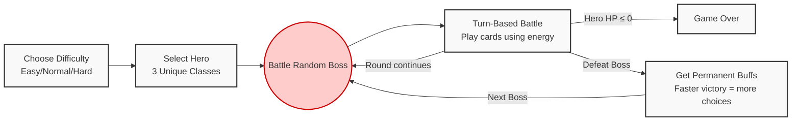

# Slay Text: Text-based Roguelike Card Game

> **COMP2113 Group Project** • The University of Hong Kong <br>
> A terminal turn-based deck-building card game inspired by *Slay the Spire*, built purely with standard C++17 STL.

## Game Description
**Slay Text** is a single-player, roguelike deck-building card game that runs entirely in the terminal. Players select one of three unique heroes, each with distinct passives and combat styles, and battle through a randomized sequence of bosses. Using energy as a core resource, players cast attack, defense, status, and utility cards to defeat enemies while managing buffs, debuffs, and a cycling deck system. 

After each boss victory, players earn permanent buffs to strengthen their subsequent encounters. The game includes three difficulty levels and a complete **Save/Load system** that preserves hero health, upgrades, and campaign progress. Victory requires defeating all bosses in sequence; defeat occurs if hero health drops to 0.

---

## How to Build and Run

### 1. Prerequisites
This project uses **only standard C++17 libraries (STL)**. No external installations or non-standard libraries are required for Linux/macOS/WSL.

### 2. Compilation
Run the following command in the project root directory (ensure you have `clang++` or `g++` installed as specified in the `Makefile`):

```bash
make all
```

### 3. Execution

After successful compilation, start the game by running:

```bash
./slay_text
```

### 4. Clean Build Files

```bash
make clean
```

------

## Gameplay Basics

### Core Game Loop

The game follows an escalating challenge loop. You can save or load your progress at any time.


